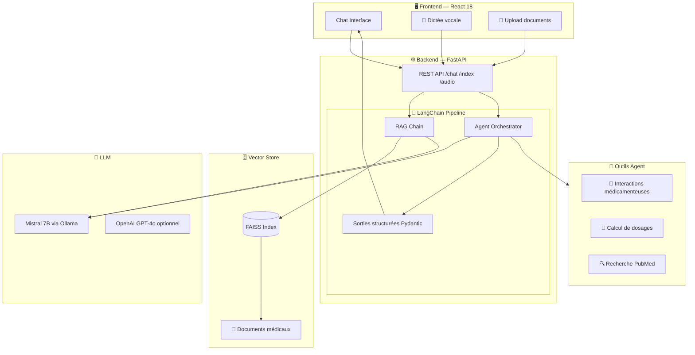
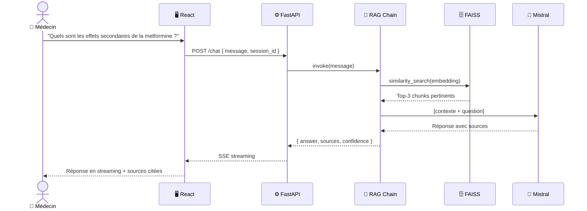

<div align="center">


<br/><br/>

# 🩺 MedAssist AI
### Chatbot médical intelligent — RAG · Agents · Multimodalité

> Un assistant IA de nouvelle génération pour les professionnels de santé.  
> Basé sur **LangChain**, **Mistral** et une architecture **RAG** vectorielle,  
> MedAssist répond aux questions médicales en citant ses sources, comprend les ordonnances  
> et peut interagir avec votre système de gestion hospitalière.

<br/>

[](https://github.com/YOUR_USERNAME/medassist-ai)
[](./docs/architecture.md)

</div>

---

## 📋 Table des matières

- [✨ Fonctionnalités](#-fonctionnalités)
- [🏗️ Architecture](#️-architecture)
- [🛠️ Stack technique](#️-stack-technique)
- [🚀 Installation rapide](#-installation-rapide)
- [📖 Guide d'utilisation](#-guide-dutilisation)
- [🔌 API Reference](#-api-reference)
- [🧪 Notebooks & Expériences](#-notebooks--expériences)
- [📂 Structure du projet](#-structure-du-projet)
- [🤝 Contribuer](#-contribuer)

---

## ✨ Fonctionnalités

| Fonctionnalité | Description | Status |
|---|---|---|
| 💬 **Chat médical RAG** | Répond en se basant sur vos documents médicaux indexés | ✅ |
| 🔍 **Recherche vectorielle** | FAISS + embeddings Mistral pour une recherche sémantique précise | ✅ |
| 🤖 **Agents autonomes** | Appel d'outils externes (APIs, calculs de dosages, interactions médicamenteuses) | ✅ |
| 🔮 **IA Prédictive & ML** | Moteur Scikit-Learn pour les scores de risques cliniques et le diagnostic | ✅ |
| 🕰️ **Mémoire Contextuelle** | Historique de conversation complet (type ChatGPT) couplé à l'IA Prédictive | ✅ |
| 🖼️ **Multimodalité** | Analyse d'ordonnances (images), transcription vocale pour dictée médicale | ✅ |
| 📁 **Upload en Direct** | Ajoutez vos PDF via l'interface (📎) pour une indexation RAG instantanée | ✅ |
| 📊 **Sorties structurées** | Réponses typées via Pydantic — fiabilité garantie | ✅ |
| 🔒 **Confidentialité** | Déployable 100% on-premise avec Ollama (aucune donnée en dehors) | ✅ |
| 🌐 **Interface React** | UI moderne style ChatGPT avec historique, sources citées et mode vocal | ✅ |

---

## 🏗️ Architecture



### Flux d'une requête RAG



---

## 🛠️ Stack technique

<div align="center">

| Couche | Technologie | Rôle |
|---|---|---|
| **LLM** | Mistral 7B (Ollama) / GPT-4o | Génération de réponses |
| **IA Prédictive** | Scikit-learn (RandomForest, NumPy) | Diagnostics, Scores de risques cliniques |
| **Orchestration** | LangChain 0.2 | RAG, Agents, Chains |
| **Embeddings** | `nomic-embed-text` / `text-embedding-3-small` | Vectorisation des documents |
| **Vector Store** | FAISS | Recherche sémantique |
| **Backend** | FastAPI + Python 3.11 | API REST & WebSocket |
| **Frontend** | React 18 + TailwindCSS | Interface utilisateur |
| **Validation** | Pydantic v2 | Sorties structurées fiables |
| **Audio** | OpenAI Whisper | Transcription vocale |
| **Vision** | GPT-4o Vision | Analyse d'ordonnances |
| **Infra** | Docker + Docker Compose | Déploiement conteneurisé |

</div>

---

## 🚀 Installation & Lancement

L'application peut être lancée très facilement via **Docker**, mais nécessite de configurer votre moteur IA (Ollama) sur votre machine physique (pour bénéficier de toute la puissance de la carte graphique de votre ordinateur).

### Étape 1 : Préparer le moteur IA (Ollama)
C'est le "Cerveau" de l'application qui s'exécutera localement pour garantir le secret médical.

1. **Téléchargez et installez Ollama** depuis le site officiel : [ollama.com](https://ollama.com/)
2. Ouvrez votre Terminal (Mac/Linux) ou Invite de commandes (Windows).
3. Téléchargez les modèles nécessaires (**Mistral** pour le chat et **Nomic Embed** pour les documents) :
   ```bash
   ollama pull mistral
   ollama pull nomic-embed-text
   ```
4. *Important* : Laissez l'application Ollama ouverte/tourner en arrière-plan sur votre ordinateur.

### Étape 2 : Lancer MedAssist avec Docker (Recommandé)

1. **Cloner le repository**
   ```bash
   git clone https://github.com/YOUR_USERNAME/medassist-ai.git
   cd medassist-ai
   ```

2. **Démarrer les conteneurs**
   Le fichier `docker-compose.yml` est préconfiguré pour connecter l'API directement à votre moteur Ollama local via `host.docker.internal`.
   ```bash
   docker-compose up --build
   ```

3. **Accéder à l'application**
   Ouvrez votre navigateur : **👉 [http://localhost:3000](http://localhost:3000)**

---

### Alternative : Lancement Manuel (Développement)

Si vous ne souhaitez pas utiliser Docker, vous pouvez tout lancer manuellement :

**Terminal 1 : Le Backend (FastAPI)**
```bash

cd backend
python -m venv .venv
source .venv/bin/activate  # Sur Windows: .venv\Scripts\activate
pip install -r requirements.txt
python -m uvicorn main:app --reload --port 8000
```

**Terminal 2 : Le Frontend (React)**
```bash
cd frontend
npm install
npm run dev
# L'interface sera alors disponible sur http://localhost:3000
```

---

### 📚 Optionnel : Indexer vos propres documents médicaux (RAG)
Pour que l'IA connaisse vos documents internes :
```bash
# Déposez vos PDF/TXT dans le dossier : data/documents/
python backend/vectorstore/indexer.py --source data/documents/
```

---

## 📖 Guide d'utilisation

### Mode Chat RAG

Posez des questions médicales, le bot répond en citant les passages pertinents de vos documents :

```
Vous : Quelles sont les contre-indications de l'ibuprofène ?

MedAssist : D'après le Vidal 2024 (p.347), l'ibuprofène est contre-indiqué en cas de :
  • Ulcère gastro-duodénal actif
  • Insuffisance rénale sévère (DFG < 30 ml/min)
  • Grossesse à partir du 6e mois
  [Source: vidal_2024.pdf, chunk 12]
```

### Mode Agent (Avec Mémoire & IA Prédictive)

L'Agent conserve **tout l'historique de votre discussion** (comme ChatGPT). Il analyse le contexte pour appeler de manière autonome nos modèles de Machine Learning (Scikit-Learn) ou ses outils de recherche :

```
Vous : J'ai 45 ans, je suis une femme, j'ai de la fièvre et une douleur de 8/10 depuis 3 jours. Qu'est ce que j'ai ?

MedAssist : [Analyse de l'historique...]
            [Appel outil: _predict_diagnosis] → 60% probabilité Infection Urinaire
            "En utilisant mes outils prédictifs, la pathologie la plus probable (60%) est une infection urinaire. Je vous recommande de consulter un médecin..."
```

### Mode Vocal

Cliquez sur 🎤 pour dicter votre question — la transcription Whisper est automatique.

### 📎 Upload de Documents (RAG Dynamique)

Vous pouvez ajouter vos propres connaissances médicales à l'IA sans toucher au code :
1.  Cliquez sur l'icône **Trombone 📎** dans la barre de chat.
2.  Sélectionnez un fichier **PDF**.
3.  L'IA indexe le document en quelques secondes.
4.  Posez vos questions en mode **📚 RAG** !

---

## 🔌 API Reference

| Endpoint | Méthode | Description |
|---|---|---|
| `/chat` | `POST` | Envoie un message, retourne une réponse RAG en streaming |
| `/chat/agent` | `POST` | Mode agent avec outils |
| `/index` | `POST` | Indexe un document dans FAISS |
| `/audio/transcribe` | `POST` | Transcription audio → texte |
| `/health` | `GET` | Statut de l'application |

**Exemple d'appel :**

```bash
curl -X POST http://localhost:8000/chat \
  -H "Content-Type: application/json" \
  -d '{"message": "Symptômes du diabète de type 2", "session_id": "abc123"}'
```

---

## 🧪 Notebooks & Expériences

| Notebook | Description |
|---|---|
| `01_data_exploration.ipynb` | Exploration et préparation des documents médicaux |
| `02_embeddings_test.ipynb` | Comparaison des modèles d'embedding (Mistral vs OpenAI) |
| `03_rag_evaluation.ipynb` | Évaluation du pipeline RAG (précision, rappel, RAGAS) |

---

## 📂 Structure du projet

```
medassist-ai/
├── 📄 README.md
├── 🐳 docker-compose.yml
├── ⚙️  .env.example
│
├── backend/
│   ├── main.py              # Point d'entrée FastAPI
│   ├── config.py            # Configuration centralisée
│   ├── chains/
│   │   ├── rag_chain.py     # Pipeline RAG LangChain
│   │   └── agent_chain.py   # Agent avec outils
│   ├── vectorstore/
│   │   ├── embeddings.py    # Modèles d'embedding
│   │   └── indexer.py       # Indexation des documents
│   ├── routers/
│   │   └── chat.py          # Routes API /chat
│   └── tools/
│       └── medical_tools.py # Outils métier pour l'agent
│
├── frontend/
│   └── src/
│       ├── App.jsx
│       ├── components/
│       │   ├── ChatInterface.jsx
│       │   └── MessageBubble.jsx
│       └── api/
│           └── chat.js
│
├── data/
│   └── documents/           # Vos PDF médicaux ici
│
└── notebooks/               # Jupyter d'exploration & évaluation
```

---

## 🤝 Contribuer

Les contributions sont les bienvenues !

```bash
# 1. Fork + clone
git clone https://github.com/Altay55stage/medassist-ai.git

# 2. Créer une branche
git checkout -b feature/ma-fonctionnalite

# 3. Commit avec convention
git commit -m "feat: ajout du module d'analyse d'ordonnances"

# 4. Pull Request
```

---

<div align="center">

**Construit avec ❤️ dans le cadre du cours d'IA — LangChain · Mistral · RAG · Agents**

</div>
